# VibeWager Market — Architecture & Flow Diagrams

This document describes how the VibeWager project works through diagrams (Mermaid). Use a Markdown viewer that supports Mermaid (e.g. GitHub, VS Code with extension) to render them.

---

## 1. High-Level System Architecture

```mermaid
flowchart TB
    subgraph Users
        U1[Admin / Owner]
        U2[Liquidity Provider]
        U3[Better]
    end

    subgraph Frontend["React App (Vite + Wagmi)"]
        UI[UI Components]
        UI --> MarketList[MarketList]
        UI --> BetSwap[BetSwap]
        UI --> Wallet[Wallet Connect / MetaMask]
    end

    subgraph BNB_Testnet["BNB Smart Chain Testnet (Chain ID 97)"]
        VW[VibeWagerMarket Contract]
        OT_Yes[OutcomeToken YES]
        OT_No[OutcomeToken NO]
        Router[PancakeRouter V2]
        Factory[PancakeFactory]
        Pair_Yes[Pair: YES/WBNB]
        Pair_No[Pair: NO/WBNB]
        WBNB[WBNB]
    end

    U1 -->|createMarket / resolveMarket| VW
    U2 -->|addLiquidityBNB| VW
    U3 -->|swap BNB ↔ Yes/No| Router

    VW -->|deploys & mints| OT_Yes
    VW -->|deploys & mints| OT_No
    VW -->|addLiquidityETH| Router
    Router --> Factory
    Factory --> Pair_Yes
    Factory --> Pair_No
    Router --> WBNB

    Frontend -->|read/write via RPC| BNB_Testnet
```



---

## 2. Contract Relationship Diagram


**Storage in VibeWagerMarket:**

- `owner` (immutable) — deployer; only address that can `createMarket` and `resolveMarket`.
- `router` (immutable) — PancakeRouter address (BNB Testnet).
- `marketCount` — total number of markets.
- `markets[id]` — for each market: `yesToken`, `noToken`, `endTime`, `resolved`, `outcome`.

---

## 3. End-to-End Flow: From Deployment to Resolution


---

## 4. Data Flow: Market Creation

```mermaid
flowchart LR
    A[createMarket(question, endTime)] --> B[Increment marketCount]
    B --> C[Deploy OutcomeToken Yes]
    B --> D[Deploy OutcomeToken No]
    C --> E[Store yesToken in Market]
    D --> F[Store noToken in Market]
    E --> G[markets[marketId] = Market(...)]
    F --> G
    G --> H[Emit MarketCreated]
```

---

## 5. Data Flow: Adding Liquidity (Betting / LP)

```mermaid
flowchart LR
    A[addLiquidityBNB(marketId, yesSide, ...) + msg.value] --> B[Load Market]
    B --> C{yesSide?}
    C -->|true| D[token = yesToken]
    C -->|false| E[token = noToken]
    D --> F[Mint token to this contract]
    E --> F
    F --> G[Approve router for token]
    G --> H[router.addLiquidityETH(token, ...)]
    H --> I[Pancake creates/updates Pair]
    I --> J[Return leftover tokens to msg.sender]
    J --> K[Emit LiquidityAdded]
```

---

## 6. Data Flow: Resolution

```mermaid
flowchart LR
    A[resolveMarket(marketId, outcome)] --> B[Load Market]
    B --> C[Require !resolved, valid market]
    C --> D[Set resolved = true]
    D --> E[Set outcome = Yes/No]
    E --> F[Emit MarketResolved]
```

---

## 7. Frontend ↔ Blockchain Interaction

```mermaid
flowchart TB
    subgraph App["React App"]
        Config[config.js: VIBEWAGER_ADDRESS, ROUTER, WBNB]
        MarketList[MarketList: marketCount, getMarket(1..n)]
        BetSwap[BetSwap: swap via Router]
        Wagmi[Wagmi: useAccount, useReadContract, useWriteContract]
    end

    subgraph RPC["BNB Testnet RPC"]
        VibeWager[VibeWagerMarket]
        PancakeRouter[PancakeRouter]
        Pairs[Pairs YES/WBNB, NO/WBNB]
    end

    Config --> MarketList
    Config --> BetSwap
    MarketList --> Wagmi
    BetSwap --> Wagmi
    Wagmi -->|read| VibeWager
    Wagmi -->|read/write| PancakeRouter
    Wagmi -->|read| Pairs
```

---

## 8. Repo Structure (Relevant to Diagrams)


These diagrams summarize deployment, contract relationships, lifecycle (create → add liquidity → resolve), and how the frontend talks to the contracts and PancakeRouter on BNB Testnet.
